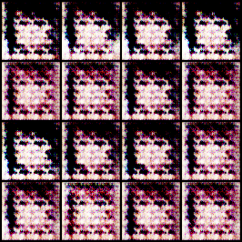

# AnimeFaceGeneration

### Description

This is a anime faces generation demo based on  DCGAN(Deep Convolutional GAN), the framework including:

- Generator: Consist of one linear layer and 4 transpose Conv layers, output [3,64,64]
- Discriminator: 5 layers strides convolution to output score for input

#### Notice:

- Generator and Discriminator use Batch Normalization and ReLU activation function in all Linear / Conv/ Transpose Conv blocks.
- Use Tanh for last layer of Generator, instead of Sigmoid for Discriminator


### Dataset

The datasets of this project is offer by **Kaggle**, you can download from [here](https://www.kaggle.com/soumikrakshit/anime-faces)

There are 21.6k  training images totally, which resolution (64,64)


#### Training 

You can train the model by run:

```python
python train.py
```

Maybe you need to change some hyper-parameters and data path by modifying [**config.py**](./config.py)


### Testing

You can also testing the model by offered pre-trained weight in ./data/out/checkpoints, running:

```python
python test.py
```


### Result

Here are some generate anime faces under different epochs in training:

|                   Epoch 0                    |                   Epoch 10                    |
| :------------------------------------------: | :-------------------------------------------: |
|         |    |
|                 **Epoch 50**                 |                 **Epoch 100**                 |
|   |  |
|                **Epoch 200**                 |                 **Epoch 400**                 |
|  |  |


Next, the test result for final model(epoch = 400)

      


### Training methodology

- Using small learning rate for both G and D
- Using label smooth to introduce random
- Control the update step rate when you see training procedure become strange


### Acknowlegement

Thanks to Google Colab offering free GPU for accelerating computing.
